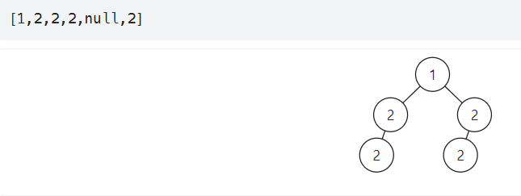

# 101. Symmetric Tree
Question description: https://leetcode.com/problems/symmetric-tree/description/?envType=study-plan-v2&envId=top-interview-150

My 1st try (18.10.2024) was not good.
Issue:
In this code, I'm comparing the inorder traversal of the left and right subtree, which doesn't correctly capture symmetry.
There is wrong will be:
when the null of number for subtree is not equal...like this 

```cpp
class Solution {

public:
    void inorderTraversal_left(TreeNode* root, vector<int>& result) {
        if (root == NULL) return;
        inorderTraversal_left(root->left, result);
        result.push_back(root->val);
        inorderTraversal_left(root->right, result);
    }
    void inorderTraversal_right(TreeNode* root, vector<int>& result) {
        if (root == NULL) return;
        inorderTraversal_right(root->right, result);
        result.push_back(root->val);
        inorderTraversal_right(root->left, result);
    }
    bool isSymmetric(TreeNode* root) {
        vector <int>rightlist;
        vector <int>leftlist;
        inorderTraversal_left(root->left, rightlist);
        inorderTraversal_right(root->right, leftlist);
        return rightlist==leftlist;    
    }
};
```

Another way works well, please read 101_SymmetricTree.cpp