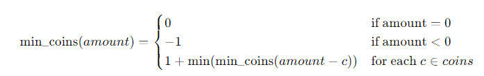

# 322. Coin Change
Question description: https://leetcode.com/problems/coin-change/description/?envType=study-plan-v2&envId=top-interview-150

My 1st try (07.10.2024) was not okay as expected, because they don't receive recursive way.
Or, I should say recursive way only work for small amounts of data.

## Main idea for recursive way: 
This problem can be solved using dynamic programming, but to find the recursive solution, we need to think in terms of the problem structure.

Recursive Form
Let’s define a function coinChange(coins, amount) that returns the minimum number of coins needed to make up the given amount.

To build the recursive relation, consider the following:

We try each coin denomination one by one.
For each coin c, if we choose this coin, we then need to find how many more coins are needed to make up the remaining amount, which is amount - c.
Thus, the recursive formula would be:

 
Explanation:
Base Case 1: If amount == 0, no coins are needed, so return 0.
Base Case 2: If amount < 0, it means we overshot the target and cannot form the required amount, so return -1.
Recursive Case: For each coin c, try to solve the subproblem amount - c. If a valid solution exists for amount - c, the current answer is 1 + min_coins(amount - c) (since we’ve used one coin).

## Memorization version
Just add a table to memeorize as demonstration [322_CoinChange_DP_memorization.cpp]
Time Complexity: O(N);Space Complexity: O(N)

## Tabulation version
build it from subproblem 
Time Complexity: O(N);Space Complexity: O(N)

As for the discription is already discussed a lot in Prob 70.

Besides, I just read the recommended solution, and the solution of Tabulation can be further optimized in space for O(1)
